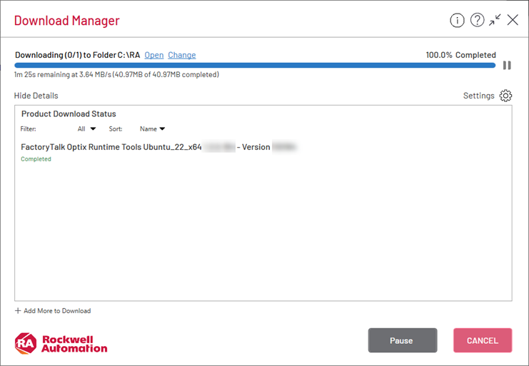
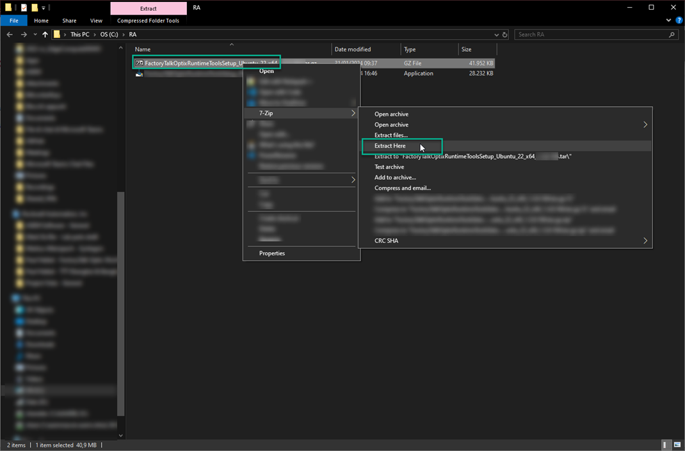
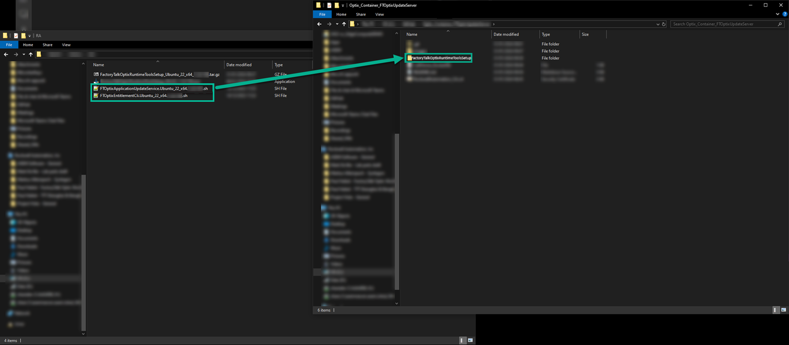

# Container setup

## Clone this repository

1. Open a terminal and run `git clone [repo url]` replacing  `[repo url]` by the URL provided on this page or through the green "Code" button at the top right corner

## Downloading the Ubuntu Runtime Tools

1. Go to the Factory Talk Hub page [link](https://home.cloud.rockwellautomation.com)
2. Select the FactoryTalk® Optix™ tile


3. Click to download the FactoryTalk® Optix™ Runtime Tools compatible with the FactoryTalk® Optix™ Studio you are going to use


4. Select the Ubuntu Runtime Tools and download it


5. Accept the user agreement and start the downloader to get the Runtime Tools file



6. Navigate to `C:\RA`, locate the downloaded file and uncompress it until you get to the `.sh` files
    - Depending on the tools you used to decompress the archive, you may need to perform the operation once or twice to get to the `.sh` script



7. You should now have two `.sh` files: 
   - `FTOptixApplicationUpdateService.Ubuntu_22_x64.X.Y.Z.ZZZ.sh` which is used to setup the UpdateServer (required to deploy the project to the container)
   - `FTOptixEntitlementCli.Ubuntu_22_x64.X.Y.Z.ZZZ.sh` which is used to manage the entitlements from the command line (optional)

8. Copy these scripts to the FactoryTalkOptixRuntimeToolsSetup folder of the `FactoryTalkOptixRuntimeToolsSetup` repository.



## Build the Docker image

1. Open the terminal to the root of this repository
2. Build the Docker container with the following command

```bash
docker build . -t optix-runtime-image -f Docker/Dockerfile
```

Example output:

```bash
root@ubuntu-VirtualBox:# docker build . -t optix-runtime-image -f Docker/Dockerfile
[+] Building 1.3s (21/21) FINISHED                                                                 docker:default
 => [internal] load build definition from Dockerfile                                                         0.0s
 => => transferring dockerfile: 1.41kB                                                                       0.0s
 => [internal] load metadata for docker.io/library/ubuntu:22.04                                              0.9s
 => [internal] load .dockerignore                                                                            0.0s
 => => transferring context: 2B                                                                              0.0s
 => [ 1/16] FROM docker.io/library/ubuntu:22.04                                                              0.0s
 => [internal] load build context                                                                            0.2s
 => => transferring context: 37.42MB                                                                         0.2s
 => DONE [ 2/16] ************                                                                                0.0s
...
 => DONE [16/16] ************                                                                                0.0s
 => exporting to image                                                                                       0.0s
 => => exporting layers                                                                                      0.0s
 => => writing image sha256:18eb........                                                                     0.0s
 => => naming to docker.io/library/optix-runtime-image                                                      0.0s
root@ubuntu-VirtualBox:#
```

3. Verify the image was built with `docker images`

```bash
root@ubuntu-VirtualBox:# docker images
REPOSITORY                TAG        IMAGE ID       CREATED          SIZE
optix-runtime-image      latest     18eba74533fb   1 minutes ago   355MB
root@ubuntu-VirtualBox:#
```
