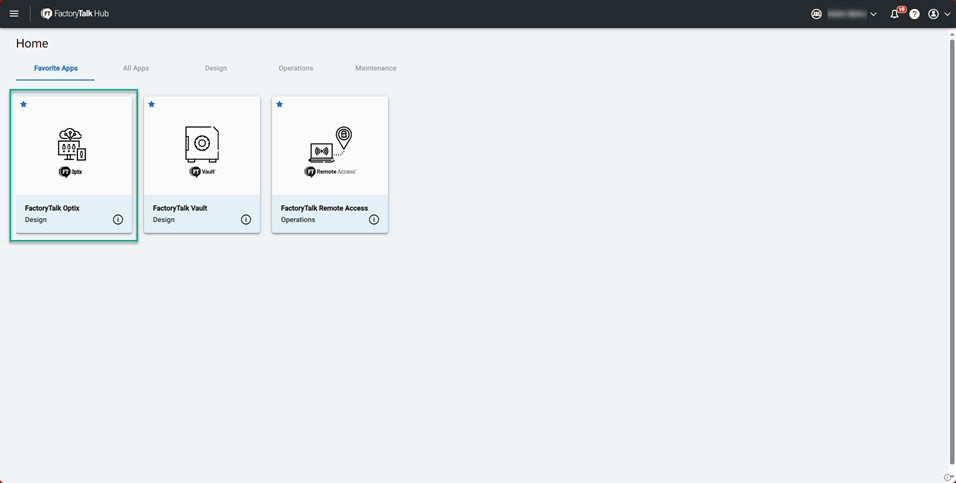
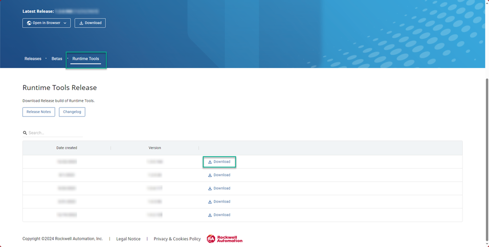
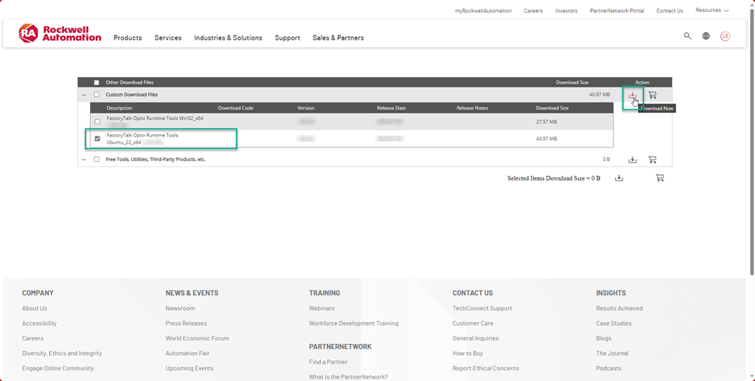
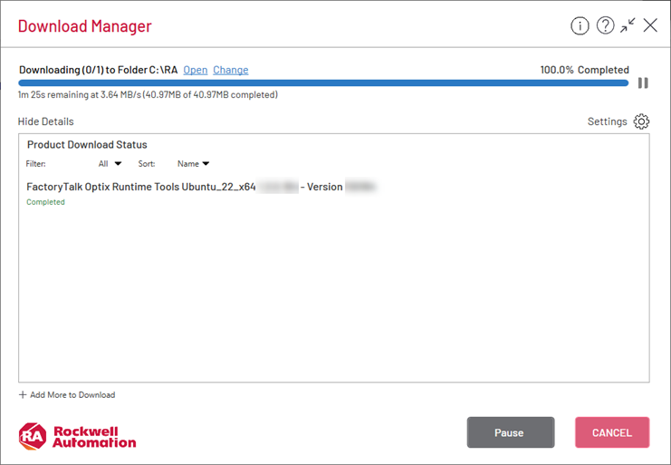
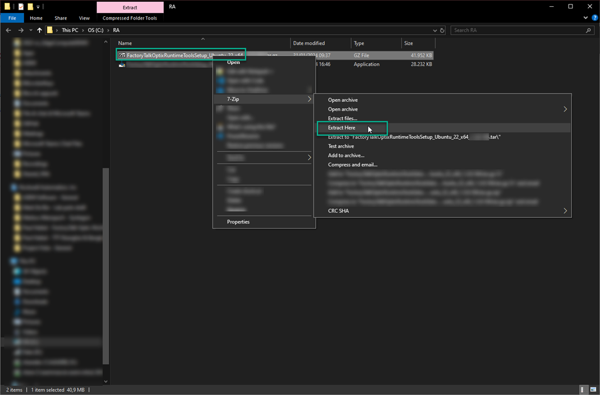
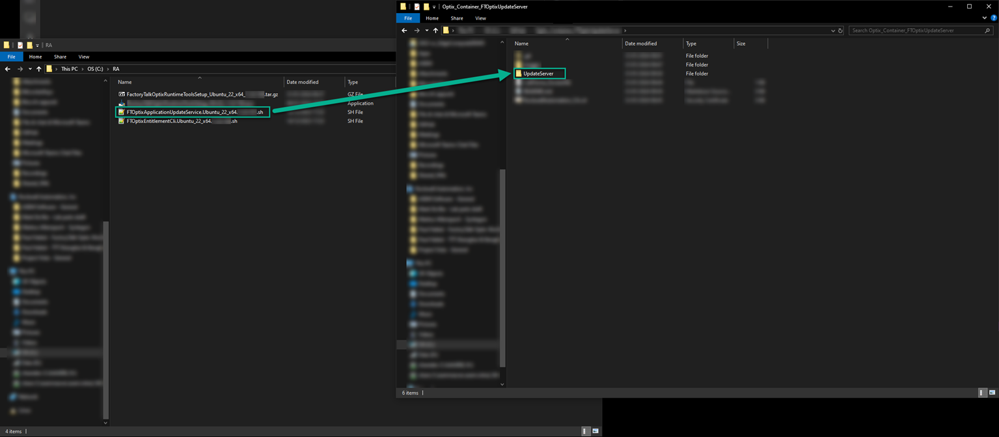
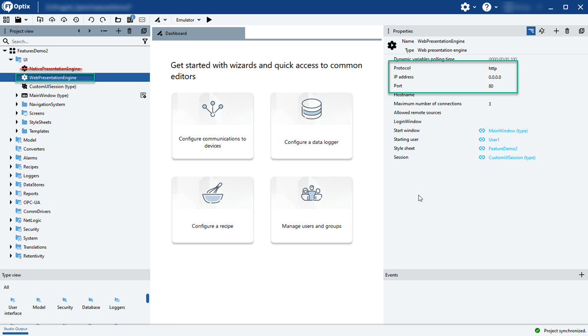
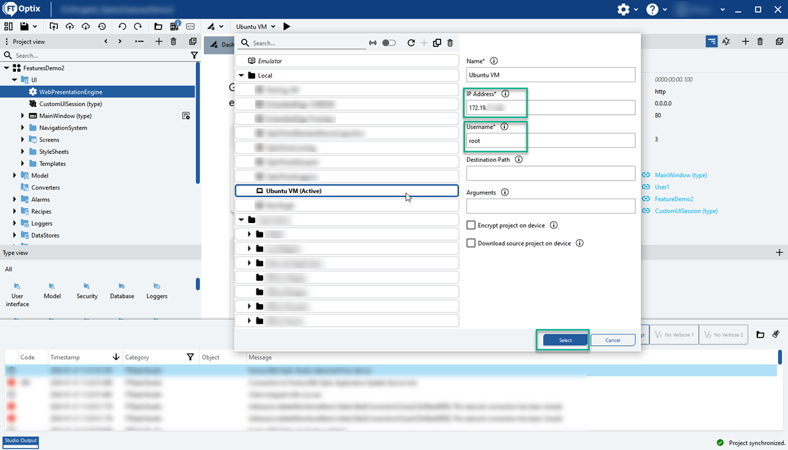
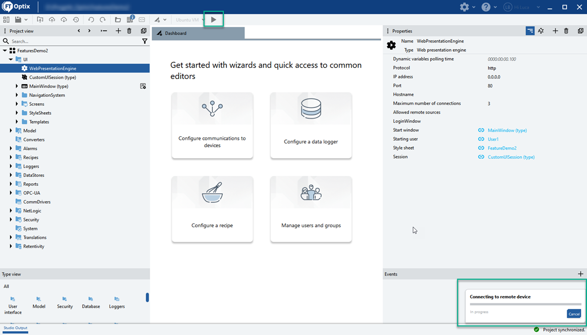
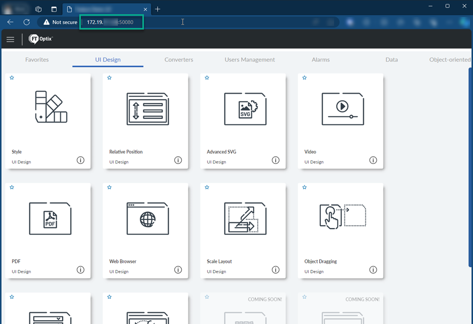

# Deploying FactoryTalk® Optix™ Applications on Docker containers

## Disclaimer

Rockwell Automation maintains these repositories as a convenience to you and other users. Although Rockwell Automation reserves the right at any time and for any reason to refuse access to edit or remove content from this Repository, you acknowledge and agree to accept sole responsibility and liability for any Repository content posted, transmitted, downloaded, or used by you. Rockwell Automation has no obligation to monitor or update Repository content

The examples provided are to be used as a reference for building your application and should not be used in production as-is. It is recommended to adapt the example for the purpose, of observing the highest safety standards.

## Introduction

This repository contains the required files to build and run a Docker Container with the Factory Talk Optix Update Service.
 
> [!NOTE]
> The default user is `admin` and the password is `FactoryTalkOptix`

> [!CAUTION]
> Upgrade of the `UpdateServer` via FactoryTalk® Optix™ IDE is not supported, a new container should be built and deployed if upgrading either the Runtime or the IDE

> [!CAUTION]
> This procedure involves some good knowledge of Linux systems and Docker containers and it is intended for advanced users

> [!TIP]
> The final container should be set to restart automatically on fail

### Runtime licensing

To activate a license and run the container for more than 120 minutes, internet connectivity to the Rockwell Automation cloud must be available at all times.
- If no internet connectivity is available, the FactoryTalk® Optix™ Application will be stopped after 120 minutes and must be deployed again from FactoryTalk® Optix™ Studio
- The license is passed to the container as an environment variable, this variable is then periodically checked to a Rockwell Automation server to check its validity

> [!CAUTION]
> As per FactoryTalk® Optix™ 1.5.x, no licensing mechanism of offline Docker Containers is available. If the container is not started with a valid license, or does not have internet connection (even if a valid license was provided), the Runtime will only work for 120 minutes. After the Runtime automatically stops, the FactoryTalk® Optix™ Application needs to be re-deployed to the container to restart.

#### Additional notes

- License is verified to the Rockwell Automation cloud every 30 minutes
- If the FactoryTalk® Optix™ Application is stopped, the license is automatically released to FactoryTalk® Hub™ to be used by another application
- If the application or the container crashes and the license is not released automatically to FactoryTalk® Hub™, please get in touch with the Rockwell Automation Software Tech Support

## Requirements

- FactoryTalk® Optix™ version 1.4.0.450 or later
- FactoryTalk® Optix™ studio installed on  the development machine
- The latest Runtime Tools for Ubuntu x86-64 compatible to the FactoryTalk® Optix™ Studio version you are using to develop the application (see below)
- Docker engine must be installed and running

> [!TIP]
> Usage of Ubuntu or Ubuntu Server as host machine is recommended

> [!TIP]
> Refer to the [official documentation](https://docs.docker.com/get-docker/) on how to get Docker running on the host machine

> [!TIP]
> Set users' right to access the Docker socket with either one of these steps if you want to execute the container in rootless mode, either by:
> - Changing the socket permissions with: `sudo chmod 666 /var/run/docker.sock` (valid up to next reboot)
> - Configuring the Docker group ([official documentation](https://docs.docker.com/engine/install/linux-postinstall/))
>   - Add the new group: `sudo groupadd docker`
>   - Add the current user to the Docker group: `sudo usermod -aG docker $USER`
>   - Reboot the machine to apply changes

## Container setup

### Clone this repository

1. Open a terminal and execute `git clone [repo url]` replacing  `[repo url]` by the URL provided on this page or through the green "Code" button at the top right corner

### Downloading the Ubuntu Runtime Tools

1. Go to the Factory Talk Hub page [link](https://home.cloud.rockwellautomation.com)
2. Select the FactoryTalk® Optix™ tile



3. Click to download the FactoryTalk® Optix™ Runtime Tools compatible with the FactoryTalk® Optix™ Studio you are going to use



4. Select the Ubuntu Runtime Tools and download it



5. Accept the user agreement and execute the downloader to get the Runtime Tools file



6. Navigate to `C:\RA`, locate the downloaded file and uncompress it until you get to the `.sh` file
    - Depending on the tools you used to decompress the archive, you may need to execute the operation once or twice to get to the `.sh` script



7. You should get two `.sh` files, copy the `FTOptixApplicationUpdateService.Ubuntu_22_x64.X.Y.Z.ZZZ.sh` to the `UpdateServer` folder of this repository
    - The `FTOptixEntitlementCli.Ubuntu_22_x64.X.Y.Z.ZZZ.sh` can be ignored, it is not used in Docker containers



### Build the Docker image

1. Open the terminal to the root of this repository
2. Build the Docker container with the following command: `docker build . -t ftoptix-updateserver -f Docker/Dockerfile`

```bash
root@ubuntu-VirtualBox:# docker build . -t ftoptix-updateserver -f Docker/Dockerfile
[+] Building 1.3s (21/21) FINISHED                                                                 docker:default
 => [internal] load build definition from Dockerfile                                                         0.0s
 => => transferring dockerfile: 1.41kB                                                                       0.0s
 => [internal] load metadata for docker.io/library/ubuntu:22.04                                              0.9s
 => [internal] load .dockerignore                                                                            0.0s
 => => transferring context: 2B                                                                              0.0s
 => [ 1/16] FROM docker.io/library/ubuntu:22.04                                                              0.0s
 => [internal] load build context                                                                            0.2s
 => => transferring context: 37.42MB                                                                         0.2s
 => DONE [ 2/16] ************                                                                                0.0s
...
 => DONE [16/16] ************                                                                                0.0s
 => exporting to image                                                                                       0.0s
 => => exporting layers                                                                                      0.0s
 => => writing image sha256:18eb........                                                                     0.0s
 => => naming to docker.io/library/ftoptix-updateserver                                                      0.0s
root@ubuntu-VirtualBox:#
```

3. Verify the image was built with `docker images`

```bash
root@ubuntu-VirtualBox:# docker images
REPOSITORY                TAG        IMAGE ID       CREATED          SIZE
ftoptix-updateserver      latest     18eba74533fb   1 minutes ago   355MB
root@ubuntu-VirtualBox:#
```

## Container execution

Now that the container is ready, we can execute it and deploy the FactoryTalk® Optix™ Application

### 1. Execute the Docker container

In this example we will assume that the base image is called `ftoptix-updateserver`, if you tagged the container with a different name, you may need to adapt the commands

#### Executing the container with a Runtime license

- Execute in shell: `docker run -itd -p 49100:49100 -p 50080:80 -e FTOPTIX_ENTITLEMENT_SERIAL_NUMBER=AAAAA-BBBBB-CCCCC-DDDDD-EEEEE ftoptix-updateserver`
    - Make sure to insert a valid serial number in the environment variable

#### Executing the container without a Runtime license

- Execute in shell: `docker run -itd -p 49100:49100 -p 50080:80 ftoptix-updateserver`
    - Without a proper license, the runtime will automatically stop after 120 minutes

### 2. Check the container status

- Execute the following command: `docker ps -a`

```bash
root@ubuntu-VirtualBox:# docker ps -a
CONTAINER ID   IMAGE                  COMMAND                  CREATED          STATUS          PORTS                                             NAMES
************   ftoptix-updateserver   "/opt/Rockwell_Autom…"   10 minutes ago   Up 10 minutes   0.0.0.0:49100->49100/tcp, 0.0.0.0:50080->80/tcp,  reverent_wilson
```

### 3. Deploy the FactoryTalk® Optix™ Application

- Prepare your FactoryTalk® Optix™ Application by:
    - Removing the NativePresentationEngine
    - Configure the WebPresentationEngine
        - Set the IP address to `0.0.0.0` (all addresses)
        - Set the Port to `80` (or any value you configured as an internal port of the container)
        - Set the Protocol to `http`



- Once the application is ready, configure the target with the proper IP Address and username and proceed with the deployment



- Proceed with the deployment



- Open the web browser and enter the URL: `http://<container_ip>:50080`



## Troubleshooting

<details>
  <summary>I passed a valid license to the container but the Runtime log says "No license tokens found, FactoryTalk Optix Runtime will be closed in: 120 minutes"</summary>

1. Make sure that the license is valid
    - Verify through FT Hub that the license is available to be used
    - Verify that the size of the license is big enough to run the application (license tokens count >= application tokens count)
2. Investigate the license SDK
    - Open a shell prompt on the host machine
    - Identify the container name with `docker ps -a`
    - Connect to the running container with `docker exec -it [container name] bash`
    - Browse to `/home/admin/Rockwell_Automation/FactoryTalk_Optix/FTOptixApplication/Log/FTOptixLicenseSDK/`
    - Inspect the `FTOptixLicenseSDK.log`
        - Here you should see the error (timeout,  invalid license key, etc.)
        - If there are issues that cannot be solved locally please get in touch with Rockwell Automation Software Tech Support

```bash
root@ubuntu-VirtualBox:# docker ps -a
ONTAINER ID   IMAGE                  COMMAND                  CREATED          STATUS                     PORTS                                                                                               NAMES
dfaa01569c9c   ftoptix-updateserver   "/opt/Rockwell_Autom…"   37 seconds ago   Up 36 seconds              0.0.0.0:49100->49100/tcp, :::49100->49100/tcp, 50080/tcp, 0.0.0.0:50080->80/tcp, :::50080->80/tcp   jolly_hofstadter

root@ubuntu-VirtualBox:# docker exec -it jolly_hofstadter bash
root@dfaa01569c9c:~# cd /home/admin/Rockwell_Automation/FactoryTalk_Optix/FTOptixApplication/Log/FTOptixLicenseSDK/
root@dfaa01569c9c:~# cat FTOptixLicenseSDK.log 
[2024-01-31 10:59:17.474] [LicenseSDK] [trace] [LicenseRepository] Called GetValidLicenses(product: Optix, component: Runtime)
[2024-01-31 10:59:17.475] [LicenseSDK] [trace] [GetValidLicenses] License storage contains 0 entitlement(s)
root@dfaa01569c9c:~# 
```
</details>

<details>
  <summary>My application crashed, how can I investigate the issue?</summary>

- Access the FactoryTalk® Optix™ Application logs
    - Open a shell prompt on the host machine
    - Identify the container name with `docker ps -a`
    - Connect to the running container with `docker exec -it [container name] bash`
    - Browse to `/home/admin/Rockwell_Automation/FactoryTalk_Optix/FTOptixApplication/Log/`
    - Inspect the `FTOptixRuntime.0.log`
- Contact Rockwell Automation Software Tech Support if needed
</details>

<details>
  <summary>How can I set the container to restart automatically if the UpdateServer fails?</summary>

- Execute the container with: `docker run -itd -p 49100:49100 -p 50080:80 -e FTOPTIX_ENTITLEMENT_SERIAL_NUMBER=AAAAA-BBBBB-CCCCC-DDDDD-EEEEE --restart unless-stopped ftoptix-updateserver`
</details>

<details>
  <summary>How can I make the application folder persistent to avoid deploying my application every time the container starts?</summary>

- Run the container by binding the runtime app path (`/home/admin/Rockwell_Automation/FactoryTalk_Optix/FTOptixApplication`) to a folder on the host machine, for example:

```bash
root@ubuntu-VirtualBox:~# docker run -itd -p 49100:49100 -p 50080:80 -e FTOPTIX_ENTITLEMENT_SERIAL_NUMBER=AAAAA-BBBBB-CCCCC-DDDDD-EEEEE -v /home/ubuntu/Documents/FTOptix:/home/admin/Rockwell_Automation/FactoryTalk_Optix/FTOptixApplication ftoptix-updateserver

d0bd53d3ef******************************************

root@ubuntu-VirtualBox:~# 
```
</details>

<details>
  <summary>How do I change the deployment password of the UpdateServer?</summary>

The UpdateServer will use the local machine's account to authenticate itself against the FactoryTalk Optix Studio. To change the deployment password you can:

- Change the default password while creating the container:
    - Open the Dockerfile
    - Change the content of: `RUN echo "admin:FactoryTalkOptix" | chpasswd`, here you can replace `FactoryTalkOptix` with any valid password you wish

- Change the default password of a running container
    - Access the container's shell using: `docker exec -it [container name] bash`
    - Execute: `echo "admin:FactoryTalkOptix" | chpasswd`, here you can replace `FactoryTalkOptix` with any valid password you wish
</details>

<details>
  <summary>I can't download the application, all I see is "wrong username or password"</summary>

- Make sure the container is up and running
- Make sure the port 49100/TCP was exposed
- Make sure the container is reachable
- Make sure the proper user and password were used (default user is `admin` and the password is `FactoryTalkOptix`)
</details>

<details>
  <summary>The license is not recognized by the FactoryTalk® Optix™ Application</summary>

- Make sure the license is marked as "Available" in FactoryTalk® Hub
- Make sure FactoryTalk® Optix™ version 1.4.0.450 or later was used
    - Every FactoryTalk® Optix™ version comes with a specific UpdateServer version
    - Make sure the right UpdateServer version was used
</details>